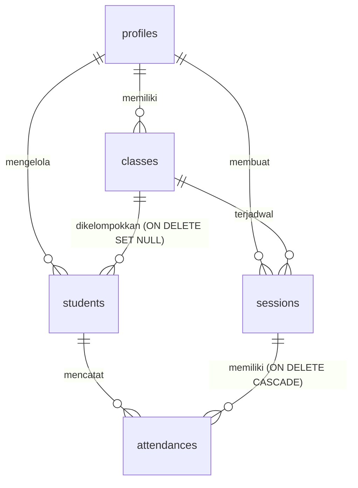

# Laporan Sistem Presensi Les Renang — Mecca Swim

**Mecca Swim** adalah aplikasi manajemen presensi digital yang dirancang khusus untuk membantu pelatih atau guru les renang dalam mengelola data murid, jadwal kelas latihan, merekam kehadiran latihan secara real-time menggunakan QR Code, serta menyajikan laporan kehadiran terperinci kepada orang tua murid.

---

## 🌟 Fitur Utama Sistem

### 1. Dasbor Utama & Statistik Real-time
* **Ringkasan Statistik**: Menampilkan metrik utama seperti total murid aktif, jumlah kelas latihan, sesi absensi hari ini, dan rata-rata tingkat kehadiran bulanan.
* **Informasi Tanggal Dinamis**: Menyajikan informasi hari, tanggal, dan tahun secara real-time yang diformat khusus dalam Bahasa Indonesia di banner utama.
* **Daftar Sesi Hari Ini**: Menampilkan status kehadiran sesi latihan yang berjalan hari ini dengan status "Aktif" atau "Ditutup".
* **Aksi Cepat (Quick Actions)**: Pintasan navigasi untuk memulai sesi baru, menambah data murid baru, dan mengekspor rekap laporan.
* **Developer Sandbox (Fase Dev)**: Panel khusus developer untuk mempermudah demo dan pengujian:
  * *Tambahkan Data Instan*: Melakukan *seeding* otomatis 7 kelas (Senin-Minggu) dan 50 data murid tiruan dengan identitas acak yang realistis.
  * *Hapus Semua Data*: Melakukan *clean purge* database (sesi, kehadiran, murid, dan kelas) milik guru bersangkutan untuk mereset lingkungan pengujian.

### 2. Manajemen Kelas Latihan (CRUD)
* Pembuatan kelas baru dengan menentukan nama kelas, hari/jadwal latihan, dan kapasitas kuota murid.
* Informasi detail kelas yang menampilkan daftar murid terdaftar dan persentase keterisian kelas.

### 3. Manajemen Murid (CRUD)
* Pendaftaran murid baru dilengkapi dengan kolom data nama lengkap, usia, jenis kelamin, kelas latihan yang diikuti, nama orang tua, serta nomor HP WhatsApp.
* **Link Portal Orang Tua**: Sistem menghasilkan token acak unik (aman) untuk setiap murid. Token ini digunakan orang tua untuk memantau kehadiran anak tanpa perlu proses login/registrasi.
* **WhatsApp Quick Share**: Tombol instan terintegrasi dengan tautan API `wa.me` untuk membagikan link portal orang tua secara cepat ke WhatsApp wali murid.

### 4. Sesi Presensi & Check-in QR Code (Real-time)
* **Generate QR Code Sesi**: Guru dapat membuka sesi presensi baru untuk kelas tertentu dengan menentukan batas waktu berlaku QR Code (15 menit, 30 menit, 60 menit, atau *Unlimited* / selama sesi aktif).
* **Live Counter**: Menggunakan teknologi **WebSocket Supabase Realtime**, dasbor guru akan langsung memperbarui status dan jumlah murid yang hadir secara instan (tanpa perlu reload halaman) sesaat setelah orang tua memindai QR Code.
* **Presensi Manual**: Guru dapat mengubah status kehadiran murid (Hadir, Izin, Sakit, Alpha) secara manual jika murid lupa membawa HP atau memindai kode.

### 5. Portal Orang Tua (Tanpa Login)
* Halaman responsif khusus orang tua untuk melacak kehadiran bulanan anak.
* Menyajikan ringkasan statistik persentase kehadiran dan riwayat absensi lengkap dengan indikator warna status yang interaktif.
* Halaman Scanner QR Code di HP orang tua untuk melakukan check-in mandiri saat latihan dimulai di kolam renang.

### 6. Berbagi Link Portal via WhatsApp (Manual Share)
* **Pesan WhatsApp Instan**: Guru dapat membagikan tautan link portal orang tua secara cepat menggunakan tombol berlogo WhatsApp yang terintegrasi dengan tautan universal `api.whatsapp.com/send`. Sistem akan membuka aplikasi WhatsApp dan menyiapkan isi pesan berisi link unik murid secara otomatis tanpa menggunakan gateway berbayar.

### 7. Ekspor Laporan Excel Berwarna (.xlsx)
* Mengunduh rekap kehadiran bulanan kelas ke dalam file Excel (.xlsx) dengan struktur rapi yang dibuat menggunakan library `exceljs`.
* Dilengkapi dengan pewarnaan otomatis (zebra-striping baris) dan pewarnaan sel status kehadiran (Hijau untuk Hadir, Kuning untuk Izin, Orange untuk Sakit, dan Merah untuk Alpha).

---

## 💻 Arsitektur Teknologi (Tech Stack)

### Sisi Frontend (Client & Server Components)
1. **Next.js (v14 App Router)**: Kerangka kerja utama yang mendukung rendering hibrida (Server Components untuk performa, Client Components untuk interaktivitas).
2. **Tailwind CSS**: Untuk styling antarmuka (UI/UX) dengan tema khusus *aquatic* (nuansa air premium menggunakan warna cyan, teal, dan biru tua) serta efek glassmorphism yang modern.
3. **TypeScript**: Menjamin keandalan kode dengan *static typing* dan deteksi error saat masa kompilasi.
4. **Lucide Icons**: Library ikon vektor yang minimalis dan seragam di seluruh halaman.
5. **React Hot Toast**: Notifikasi pop-up yang informatif, ringan, dan interaktif.

### Sisi Backend & Database (BaaS)
1. **Supabase**: Backend-as-a-Service utama yang menyediakan:
   * **PostgreSQL Database**: Penyimpanan data relasional yang terstruktur.
   * **GoTrue Auth**: Autentikasi guru les renang (signup/login dengan pengamanan JWT).
   * **Row-Level Security (RLS)**: Proteksi data tingkat baris untuk menjamin guru hanya bisa membaca/menulis data milik mereka sendiri.
   * **Database Triggers**: Sinkronisasi otomatis data profil ke tabel `profiles` saat user baru terdaftar di auth.
   * **Supabase Realtime**: Sinkronisasi data absensi secara instan melalui protokol WebSocket.

### Library Pendukung
* **exceljs**: Pembuatan file dokumen spreadsheet Excel (.xlsx) yang dinamis dari sisi client dengan dukungan kustomisasi font, border, lebar kolom, dan warna sel.

---

## 📁 Struktur Folder Proyek

```text
mecca-swim/
├── src/
│   ├── app/                      # Next.js App Router (Routing halaman & API)
│   │   ├── api/                  # Endpoint API Route (whatsapp, callback, dll)
│   │   ├── dashboard/            # Halaman Dashboard Guru (akses terproteksi)
│   │   │   ├── kelas/            # Manajemen Kelas
│   │   │   ├── murid/            # Manajemen Murid
│   │   │   ├── rekap/            # Laporan & Ekspor Excel
│   │   │   └── sesi/             # Sesi Presensi QR
│   │   ├── login/                # Halaman login/register guru
│   │   ├── murid/                # Portal orang tua murid (akses token)
│   │   └── scan/                 # Halaman scan QR code presensi
│   ├── components/               # Komponen UI modular
│   │   ├── layout/               # Header, Sidebar, MobileNav
│   │   └── ui/                   # Reusable atomic UI (Button, Card, Modal, dll)
│   ├── hooks/                    # Kustom React hooks (useAuth, useRealtime, dll)
│   ├── lib/                      # Utilitas & konfigurasi client Supabase
│   └── services/                 # Layer service backend (query Supabase)
├── supabase/
│   └── migration.sql             # Skrip skema database, RLS, indeks, dan trigger
├── package.json                  # Konfigurasi dependensi project
└── tailwind.config.ts            # Konfigurasi kustom tema warna & animasi Tailwind
```

---

## 🗄️ Skema Database & Relasi Tabel

Relasi database didesain secara relasional dengan integritas data yang kokoh menggunakan `FOREIGN KEY` dengan perilaku `ON DELETE CASCADE` dan `ON DELETE SET NULL`.



### Penjelasan Tabel:
1. **profiles**: Menyimpan data identitas Guru (dihubungkan langsung ke tabel internal `auth.users` milik Supabase).
2. **classes**: Menyimpan data kelas latihan renang milik guru tertentu.
3. **students**: Menyimpan data murid. Hubungan ke tabel `classes` menggunakan `ON DELETE SET NULL` sehingga jika kelas dihapus, data murid tidak ikut terhapus melainkan kelasnya diset menjadi kosong.
4. **sessions**: Sesi latihan harian yang dibuka untuk kelas tertentu. Menghapus kelas akan menghapus seluruh sesinya (`ON DELETE CASCADE`).
5. **attendances**: Log kehadiran murid. Dihubungkan ke tabel `sessions` dan `students` dengan aturan `ON DELETE CASCADE` sehingga pembersihan data murid atau sesi akan secara otomatis membersihkan seluruh riwayat presensi terkait.
